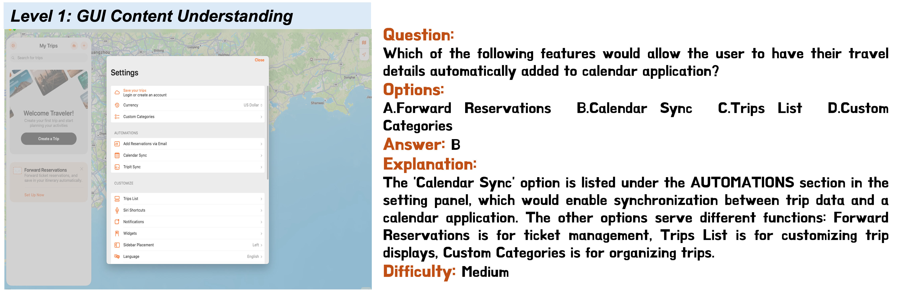
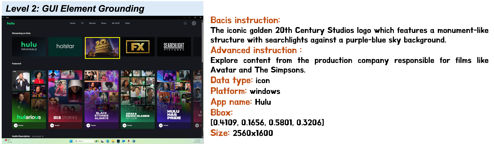
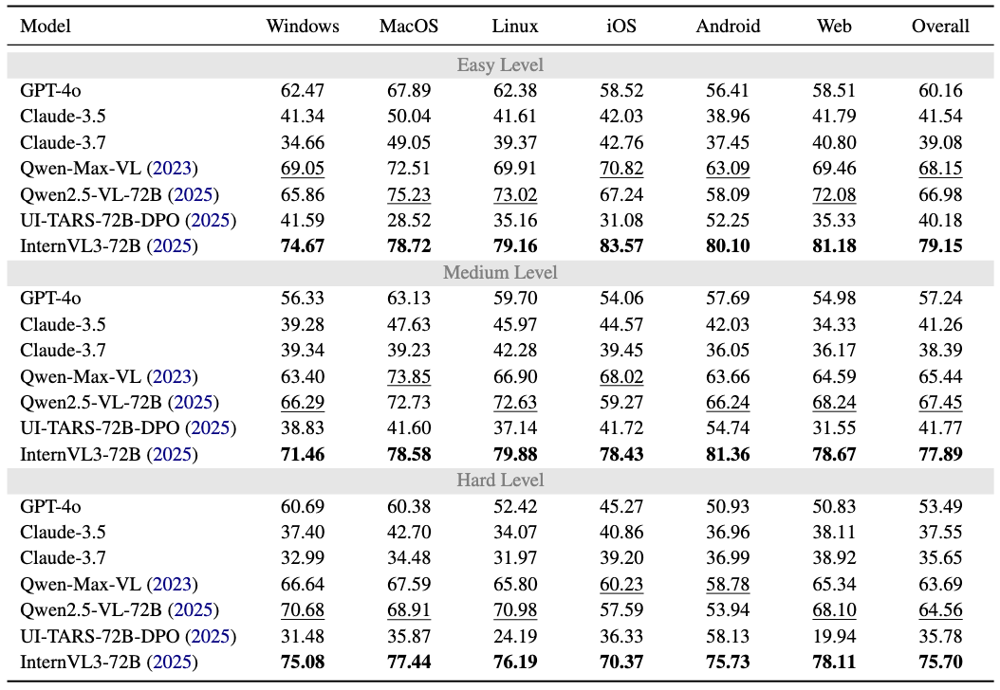
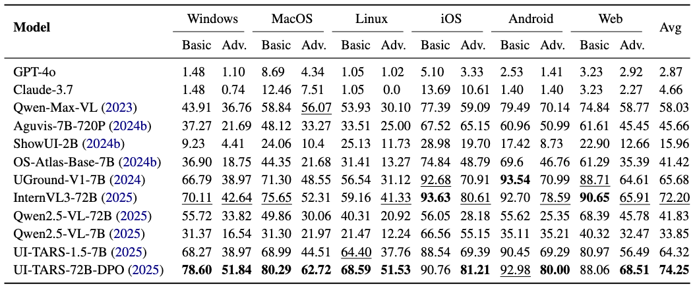
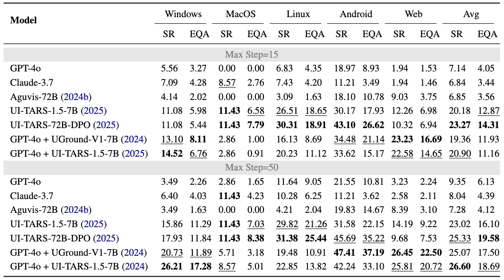
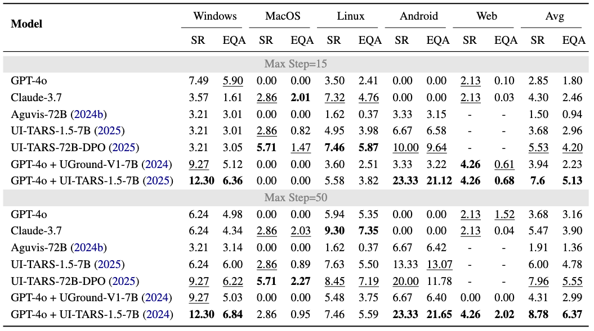

# 🖥️ MMBench-GUI: Hierarchical Multi-Platform Evaluation Framework for GUI Agents

> [!NOTE]
> Our technical report will be released on arxiv.org *in next week* after finishing the twice validation of evaluation results we have obtained one month ago.


## 📖 Introduction

We are happy to release MMBench-GUI, a hierarchical, multi-platform benchmark framework and toolbox, to evaluate GUI agents. MMBench-GUI is comprising four evaluation levels: GUI Content Understanding, GUI Element Grounding, GUI Task Automation, and GUI Task Collaboration. We also propose the Efficiency–Quality Area (EQA) metric for agent navigation, integrating accuracy and efficiency. MMBench-GUI provides a rigorous standard for evaluating and guiding future developments in GUI agent capabilities.

MMBench-GUI is developed based on [VLMEvalkit](https://github.com/open-compass/VLMEvalKit), supporting the evaluation of models in a API manner or local deployment manner. We hope that MMBench-GUI will enable more researchers to evaluate agents more efficiently and comprehensively. You can refer to the [How-to-Use](#how-to-use) section for detailed usage.





<p style="text-align: center">Examples of each level of tasks</p>


### Features

* **Hierarchical Evaluation**: Motivated by the use of levels L1~L5 in autonomous driving, we developed the hierarchical evaluation framework to systematically and comprehensively assess GUI agents' capabilities. In short, we organize the evaluation framework into four ascending levels.
* **Support multi-platform evaluation**: we establish a robust, multi-platform evaluation dataset encompassing diverse operating systems, such as Windows, macOS, Linux, iOS, Android, and Web interfaces, ensuring extensive coverage and relevance to real-world applications.
* **A more human-aligned evaluation metric for planning**: We value both speed and quality of the agent. Therefore, we propose the Efficiency–Quality Area (EQA) metric that balances accuracy and efficiency, rewarding agents that achieve task objectives with minimal operational step, to replace  Success Rate (SR).
* **Manually reviewed and optimized online task setup**: We conducted a thorough review of existing online tasks and excluded those that could not be completed due to issues such as network or account restrictions.
* **More up-to-date evaluation data and more comprehensive task design**: We collected, annotated, and processed additional evaluation data through a semi-automated workflow to better assess the agent’s localization and understanding capabilities. Overall, the benchmark comprises over 8,000 tasks spanning various operating platforms.

### Todos

* [ ] Release our technical reports where we have evaluated some GUI Agents on our benchmark.
* [ ] Support `circular` mode for the evaluation of `GUIContentUnderstanding`.
* [ ] Support `GUITaskAutomation` based on Docker for all platforms.
* [ ] Support `GUITaskCollaboration` based on Docker for all platforms.

## 🪧 News

* **2025.06.24** We have released the refactoring code for level1-GUI Content Understanding and level2-GUI Element Grounding tasks. Next, tasks of level3 and level4 will also be integrated into this codebase.
* **2025.06.24** We have released the images and json files used in level1-GUI Content Understanding and level2-GUI Element Grounding tasks. Resources of level3 and level4 will be release in the next one or two weeks.

## 📊 Performance

> **Note:** We are validating the final results again. Thus, performance of models shown in this table would change and we will update this as soon as possible.

Results shown in these tables are obtained through API-based manner, and we keep the same parameters for all models.

#### 1. Performance on Level1 - GUI Content Understanding.



#### 2. Performance on Level2 - GUI Element Grounding.



#### 3. Performance on Level3 - GUI Task Automation.



#### 4. Performance on Level4 - GUI Task Collaboration.



## ⚙️ How-to-Use

In this section, we provide detailed instructions on how to use MMBench-GUI to evaluate your model, including the design principle, the architecture of our code, the steps to adapt to your model, and some common issues we think. 

#### Design principle

Our core **design principle** is to enable partial customization of model-side functionality based on currently common training/inference paradigms (such as `transformers` or API-based approaches), so that most of the code can be reused.

Specifically, we avoid introducing model files or external code directly into the project by supporting universal interfaces like `transformers.from_pretrained` for local deployment and `client.chat.completions.create` for OpenAI-style API calls.

Once the `data` flows out from the `dataloader`, the inference pipeline is divided into four stages:

1. `custom_build_prompt`: Organizes the `data` along with `system prompts` and `user prompts` into a standardized dictionary called `messages`.

2. `preprocess_func`: Further formats `messages` into `inputs` suitable for:

    - a processor (implemented via `transformers`) — yielding tokenized tensors like `input_ids`, or

    - a payload (for OpenAI-style APIs) — including the input content and corresponding generation configurations (e.g., temperature settings).

3. `generate`: Calls the model's `generate` method (if using `transformers`) or invokes the `client.chat.completions.create` (if using an OpenAI-style API) to produce predicted `outputs`.

4. `postprocess_func`: Processes the `outputs` into final `responses`, extracting the relevant content from the model's predictions.

After these steps, the evaluations of `responses` are conducted using `our_benchmark.evaluate`. In this process, all you need is to provide (or use our default implementation) a customized function to parse key informations.

**Based on above instruction, you are only required to implement a `custom_build_prompt`, a `preprocess_func`, a `postprocess_func`, and a `parse_response_func`. We have achieved [default functions](DEFAULT_FUNCTIONS.md) in our base model and benchmarks to handle these processes and if you do not have special format to be configured, you even DO NOT need to write these four functions!**

#### The architecture of our code

```text
MMBench-GUI/
|-- benchmarks/                          // We put all levels of benchmarks here
|   |-- __init__.py
|   |-- l1_content_understanding.py
|   |-- l2_element_grounding.py
|   |-- l3_task_automation.py
|   |-- l4_task_collaboration.py
|   `-- matrics.py
|-- models/                              // You are allowed to put code relative to your model here.
|   |-- __init__.py
|   |-- api_gpt.py
|   |-- api_uitars.py                   // One api-based example. We recommend you follow this example to implement your api-based model.
|   |-- base.py                         // Our model wrapper, including API-based and local-based.
|   |-- local_aguvis.py
|   `-- local_uitars.py                 // One local-based example. We recommend you follow this example to implement your local-based model.
|-- utils/
|   |-- __init__.py
|   |-- download.py                     // You can run this to download and extract images and json files automatically.
|   |-- import_utils.py
|   |-- inference_tools.py              // Inference loops, including api-based and local-based.
|   `-- misc.py
|-- configs/                             // You are allowed to put configs about your model here.
|   |-- config_api_gpt.json
|   |-- config_api_uitars.json          // One api-based config corresponding to models.api_uitars.py
|   |-- config_local_aguvis.json
|   `-- config_local_uitars.json        // One local-based config corresponding to models.local_uitars.py
|-- requirements/
|   `-- dev_env.txt                     // We export the packages details of our development env.
|-- requirements.txt                    // You know
`-- evaluate.py                         // Run this file to start your evaluation.

```

#### The architecture of our data

You can run `LMUData=/path/of/data python utils/download.py` to automaticly download data.

```text
DATA_ROOT/                              // We use LMUData in VLMEvalkit as default root dir.
|-- MMBench-GUI/                          
|   |-- offline_images/
|   |   |-- os_windows/
|   |   |   |-- 0b08bd98_a0e7b2a5_68e346390d562be39f55c1aa7db4a5068d16842c0cb29bd1c6e3b49292a242d1.png
|   |   |   |-- ...
|   |   |-- os_mac/
|   |   |-- os_linux/
|   |   |-- os_ios/
|   |   |-- os_android/
|   |   `-- os_web/
|   |-- L1_annotations.json
`---|-- L2_annotations.json 
```

#### Development guidance

> [!TIP]
> We highly recommend you to refer the example implementations in `models.local_uitars` and `models.api_uitars`, and corresponding config files in `configs/config_local_uitars.json` and `configs/config_api_uitars.json`, respectively, for details. You can copy these files, rename them and then write your functions.

Next, we introduce the integrating of **UI-TARS-1.5** with local deployment manner as an example.

1. Clone this repo

```shell
git clone https://github.com/open-compass/MMBench-GUI.git
```

2. Create a python file in `models`. For example: `local_uitars.py`.

```shell
cd MMBench-GUI
touch models/local_uitars.py
```

3. Implement relevant functionalities as needed. We **assume** that the model to be evaluated may have its *own unique prompt format, tokenization process, post-processing steps, and result parsing method*. However, in most cases, the differences between models lie primarily in the system and user prompts, as well as in how the results are parsed.

    - implement `custom_build_prompt` function (the function name is not strictly restricted). In this implementation, we only customize user prompt and use default system prompt of UI-TARS model.
    ```python
    def build_custom_prompt(line, dataset):
        """
        Build prompts as you need. 

        Args:
            line (dict), original data from dataloader.
                An example for level1:
                line={
                        "index":0,
                        "image_path": "os_ios/9e304d4e_5fdc3924_51c74094e7e217f384edd0d882ea6fb19b839ddc029893daa6dd17fafb49b3d6.png",
                        "question": "Based on the navigation elements, what can be inferred about the current screen's position in the app's hierarchy?",
                        "options": {
                            "A":"It's a sub-screen within a 'Rings' section",
                            "B":"It's the main dashboard of the app",
                            "C":"It's a sub-screen within the 'Summary' section",
                            "D":"It's a standalone 'Awards' page accessible from anywhere",
                            "E":"It's the 'Sharing' section of the app"
                        },
                        "answer": "C",
                        "explanation": "The green back arrow at the top left with 'Summary' indicates this is a sub-screen within the Summary section. The bottom navigation also shows 'Summary' highlighted, confirming we're in a sub-page (specifically 'Awards') within the Summary section, not on the main Summary page itself.",
                        "difficulty": "easy"
                        "image_size":[
                            1179,
                            2556
                        ],
                        "platform":"os_ios",
                        "app_name":"Fitness"
                }

                An example for level2:
                line={
                        "index":0,
                        "image_path":"os_windows/0b08bd98_a0e7b2a5_68e346390d562be39f55c1aa7db4a5068d16842c0cb29bd1c6e3b49292a242d1.png",
                        "instruction":"The downward arrow button allows you to scroll down through the list of years.",
                        "bbox":[
                            0.3875,
                            0.1361,
                            0.3945,
                            0.1507
                        ],
                        "image_size":[
                            2560,
                            1440
                        ],
                        "data_type":"icon",
                        "platform":"os_windows",
                        "app_name":"calendar",
                        "grounding_type":"basic"
                }
            dataset (str), the name of the benchmark. It can be used to determine different prompt format for different task.
                            It should be one of ["GUIElementGrounding", "GUIContentUnderstanding", "GUITaskAutomation", "GUITaskCollaboration": ,']
        Returns:
            msgs (list[dict]): inputs to model. It will be processed by preprocess_uitars provided by this file after some nessaccery checking.
                It should follow this format:
                [
                    {'role': 'xxxxx', 'type': 'image/text', value: 'xxxxx},
                    {'role': 'xxxxx', 'type': 'image/text', value: 'xxxxx},
                    ...
                    {'role': 'xxxxx', 'type': 'image/text', value: 'xxxxx}
                ]

        """
        msgs = []

        tgt_path = os.path.join(
            "path/to/image/dir",
            line["image_path"],
        )
        instruction = line["instruction"]

        if dataset == "GUIElementGrounding":
            msgs.append({"role": "user", "type": "image", "value": f"{tgt_path}"})

            msgs.append(
                {
                    "role": "user",
                    "type": "text",
                    "value": GROUNDING_user_prompt.format(instruction=instruction),
                }
            )
            return msgs
        elif dataset == "GUIContentUnderstanding":
            msgs.append({"role": "user", "type": "image", "value": f"{tgt_path}"})

            msgs.append(
                {
                    "role": "user",
                    "type": "text",
                    "value": QA_user_prompt.format(instruction=instruction),
                }
            )
            return msgs
        else:
            pass
    ```

    - implement `preprocess_uitars` function to process the outputs of `build_custom_prompt` (the function name is not strictly restricted)
    ```python
    def preprocess_uitars(message, model, processor, **kwargs):
        """
        Process message into input_ids, attn_masks, etc.

        Args:
            message (list[dict])
                    An example:
                        message = [
                            dict(role='system', type='text', value='You are an agent.'),
                            dict(role='user', type='image', value='path/to/your/image.png'),
                            dict(role='user', type='text', value='your user prompt')
                        ]
                    The system prompt is optional and it's determined by your setting.
            model (LocalModelWrapper, ApiModelWrapper), this is used to get any variables or functions you need from model
            processor (transformers.AutoProcessor), this is used to get any variables or functions you need from processor
            kwargs (optional), parameters provided in your config: `models.your_model_name.kwargs`

        Returns:
            inputs (dict, BatchFeature): outputs from processor

        """
        from qwen_vl_utils import process_vision_info

        messages = []
        if "system" == message[0]["role"]:                                              # append system_prompt if exists. In our implementation, this will be skipped since we use default system prompt of UI-TARS
            messages.append({"role": "system", "content": message[0]["value"]})
            message = message[1:]
        messages.append(
            {"role": "user", "content": prepare_content(message, processor, **kwargs)}  # append user prompt and image url/path using `prepare_content` function, we omit this here and you can refer to `models.local_ui_tars.py` for details.
        )

        text = processor.apply_chat_template(                                           # apply chat template. The processor is built by AutoProcessor.from_pretrained in our benchmark. Thus, you can directly call the function.
            [messages], tokenize=False, add_generation_prompt=True
        )

        images, videos = process_vision_info([messages])                                # process image represented by url/path into base64 or PIL.Image
        inputs = processor(                                                             # call processor to generate inputs.
            text=text, images=images, videos=videos, padding=True, return_tensors="pt"
        )
        inputs = inputs.to("cuda")

        return inputs
    ```

    - implement `postprocess_uitars` function to process the output of model (the function name is not strictly restricted). 
    ```python
    def postprocess_uitars(outputs, model, processor, **kwargs):
        """
        Process outputs into response.

        Args:
            outputs (Tensor, tuple[Tensor]), the outputs from your model, it should be decode to obtain predicted texts.
            model (LocalModelWrapper, ApiModelWrapper), this is used to get any variables or functions you need from model
            processor (transformers.AutoProcessor), this is used to get any variables or functions you need from processor
            kwargs (optional), parameters provided in your config: `models.your_model_name.kwargs`

        Returns:
            resp (str): response from your model

        """
        if isinstance(outputs, tuple):
            outputs = outputs[0]
        if isinstance(outputs, torch.Tensor):
            outputs = outputs.cpu().numpy()
        out = processor.batch_decode(                                               # decode outputs of model
            outputs, skip_special_tokens=True, clean_up_tokenization_spaces=True
        )

        response = out[0]
        resp = response.split("assistant\n")[-1]                                    # extract the part of assistant
        return resp                                                                 # example: resp = "Action: click(point=[23,67])"
    ```

    - implement `parsing_function` to parse the outputs of `postprocess_uitars` into required format (the function name is not restricted).
    ```python
    def parse_grounding_response(response, meta):
        """Parse coordinates from model's response for evaluation

        Args:
            response (str), response from model. It is also the outputs of postprocess_uitars or our default postprocess function.
            meta (dict), original data from dataloader.

        Returns:
            parsed_predicted_point (list, None): The parsed coordinates of your prediction.
        """
        click_point = re.findall(r"\d+", response)
        if len(click_point) == 2:
            click_point = [int(x) for x in click_point]
            parsed_predicted_point = uitars_postprocess(                            # UI-TARS follows the coordinates transformation of Qwen2.5VL
                click_point, ast.literal_eval(meta["image_size"])
            )
            return parsed_predicted_point                                           # valid output = [23, 67]
        else:
            return None
    ```

4. Create a config file `config_local_uitars.json` in `configs`

```shell
touch configs/config_local_uitars.json
```
and write relavant informations, such as the path of customized functions, parameters.

```json
{
    // configurations for model
    "model": {
        // Your model name. This is an identifier for logging.                                                                
        "uitars-1.5-7b-local": {
            // If you use api-based model, this parameter should be: base_url?api_key=xxx&model=xxx. For example:  "https://api.openai.com/v1?api_key=your-api-key=gpt-4o"
            "model_path": "/path/of/your/checkpoints/UI-TARS-1.5-7B",

            // This parameter will be passed into LocalModelWrapper.your_model.generate or APIModelWrapper.client.chat.completions.create
            "generate_cfg": {                                                       
                "max_new_tokens": 512
            },

            // Currently, we only support transformers and api mode.
            "imp_type": "transformers",                               

            // Most models follow the design of transformers, and thus this parameter do not need to be modified.              
            "generate_function": "generate",                           

            // The path of our customized function `preprocess_uitars` in the file we created in step 3.             
            "preprocess_function": "models.local_uitars.preprocess_uitars",       

            // The path of our customized function `postprocess_function` in the file we created in step 3.  
            "postprocess_function": "models.local_uitars.postprocess_uitars",       

            // This can determine which task will use custom prompt and will call your function implemented in step 3.
            // Once you set a custom prompt for a task(for example GUIElementGrounding), the parameter `kwargs['system_prompt']` will NOT work.
            "custom_prompt": {
                
                // For example, we only build custom prompt for GUIElementGrounding task. Therefore, the prompt for GUIContentUnderstanding will be built by default function in `benchmarks.l1_content_understanding.py`
                "GUIElementGrounding": "models.local_uitars.build_custom_prompt"
            },

            // These args can be fetched in your customized functions and you are free to use.
            "kwargs": {               
                
                // IMPORTANT. There are three mode: ['model_default', 'benchmark_default', 'directly write your system prompt']. 
                // This parameter only take effect when you DO NOT set custom prompt for a task. For example, in this config, you will build customized prompt for GUIElementGrounding task 
                // while GUIContentUnderstanding task will adopt default prompt in our benchmark and the parameter `system_prompt` will take effect.
                // - mode `model_default`: use your default system prompt in your model. Thus, content with `role='user'` are preserved in messages.
                // - mode `benchmark_default`: use our default system prompt in our benchmark.
                // - mode `directly write your system prompt`: you can directly set system prompt here and this will be append in messages.
                "system_prompt": "model_default",     

                // These args can be configured freely. `img_size` currently do not take effect and we plan to support customize the image size in the future.
                "max_pixels": 2116800,
                "min_pixels": 3136,
                "img_size": -1,
                "img_detail": "low"
            }
        }
    },

    // configurations for benchmark
    "data": {                                                                       
        "GUIElementGrounding": {
            // usable mode: ['all', 'basic', 'advanced']. When mode='all', both 'basic' and 'advanced' splits will be evaluated.
            "mode": "all",                                                          

            // The customized parsing function we implemented in step 3.
            "parse_function": "models.local_uitars.parse_grounding_response"        
        },
        "GUIContentUnderstanding": {

            // available mode: ['all', 'easy', 'medium', 'hard']
            "mode": "all",                                                          

            "parse_function": "models.local_uitars.parse_understanding_response",

            // Currently, we don't support judge model to check whether the predicted option matchs the GT in level 1. We provide a strong regex pattern to extract options in our code and we find it works well.,
            "match_mode": "exact_match"                                            
        }
    }
}
```

> [!WARNING]
>  Please pay attention to the role of `custom_prompt` and `kwargs['system_prompt']`. 
>
> `custom_prompt` has a higher priority than `kwargs['system_prompt']`. If a prompt function is defined in `custom_prompt` for a task, the system_prompt in `kwargs['system_prompt']` will be ignored for this task. If your format does not require special customization, we recommend configuring `kwargs['system_prompt']` directly to define your system_prompt. Otherwise, if more control is needed, we suggest implementing `custom_prompt` to fully customize the behavior.


5. Start evaluation and the output dir is defined in `.env` file through the `EVAL_WORK_DIR` variable.

```shell
python evaluate.py --config configs/config_local_uitars.py
```
Our code is based on VLMEvalkit, thus the root path of data can be defined with the `LMUData`:

```shell
LMUData=/mnt/hwfile/any/dir/LMUData python evaluate.py --config configs/config_local_uitars.py
```

#### Common issues

Coming soon!

**If you have any questions, please feel free to open an issue.**


## 🌺 Acknowledgement

We would like to thank the following outstanding works, which provided important references for the development of MMBench-GUI.

- [VLMEvalkit](https://github.com/open-compass/VLMEvalKit)

- [OSWorld](https://github.com/xlang-ai/OSWorld)

- [Android Lab](https://github.com/THUDM/Android-Lab)

- [ScreenSpot](https://github.com/njucckevin/SeeClick)

- [ScreenSpot-Pro](https://github.com/likaixin2000/ScreenSpot-Pro-GUI-Grounding)

- [WindowsAgentArena](https://github.com/microsoft/WindowsAgentArena)

- [WebArena](https://github.com/web-arena-x/webarena)


## 📌 Citation

If you find our paper and code useful in your research, please consider giving a star :star: and citation :pencil: :)

```Bibtex

```