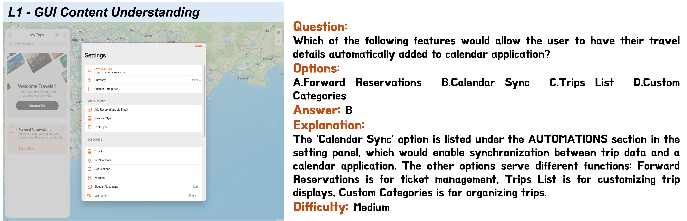
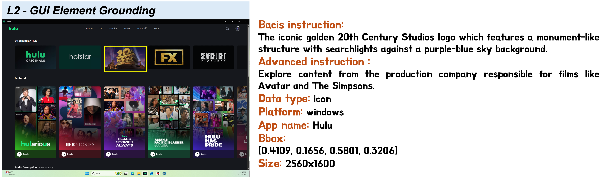
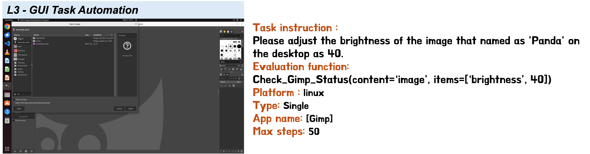
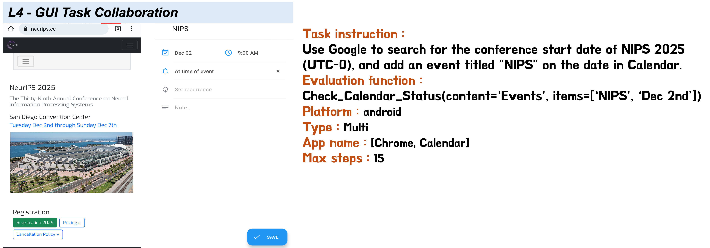
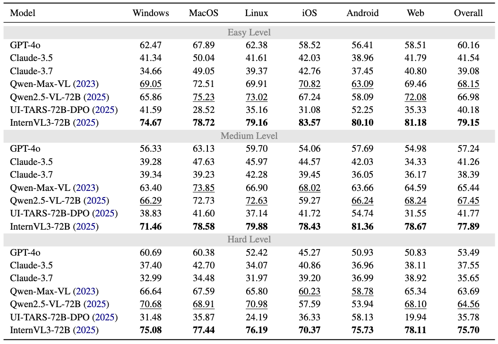
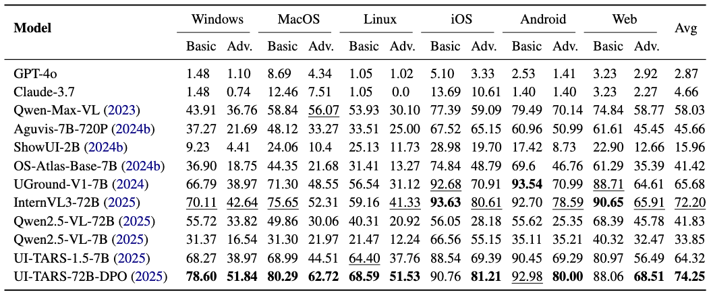
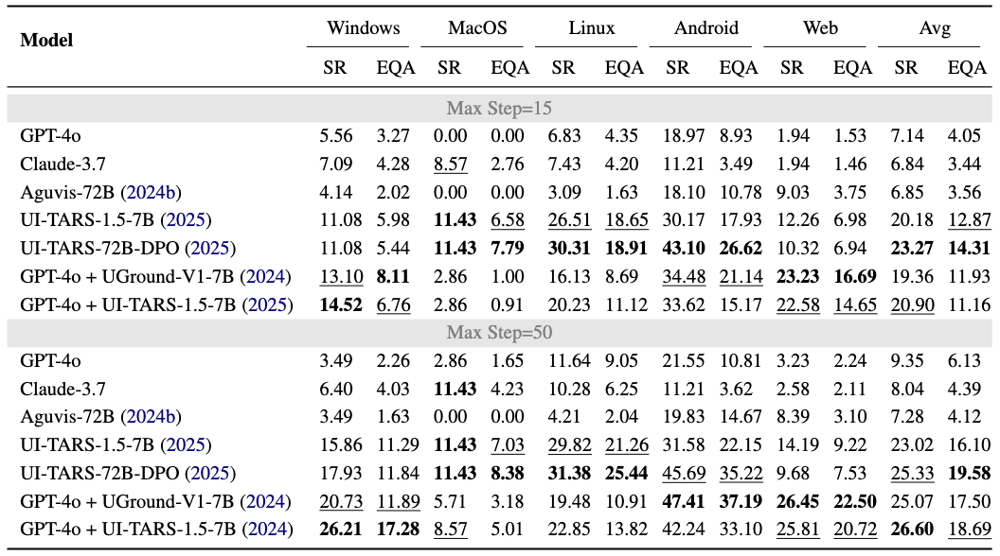
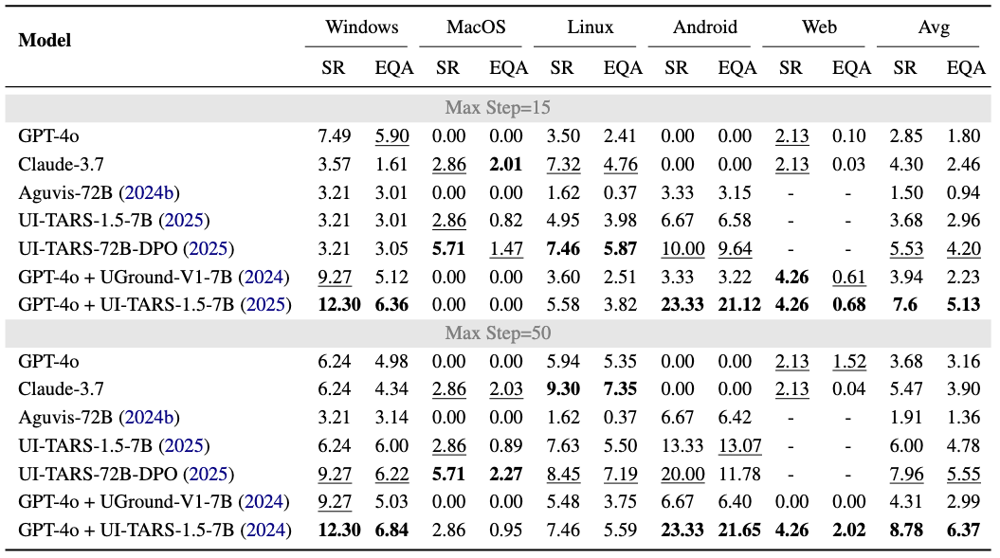

# 🖥️ MMBench-GUI: Hierarchical Multi-Platform Evaluation Framework for GUI Agents

<p align="center">
🤗 <a href="https://huggingface.co/datasets/OpenGVLab/MMBench-GUI">Evaluation Data</a>&nbsp&nbsp | &nbsp&nbsp📑 <a href="#">Paper (coming soon)</a>&nbsp&nbsp | &nbsp&nbsp📢 <a href="#">Leaderboard (coming soon)</a>
</p>

> [!NOTE]
> Our technical report will be released on arXiv *in next week*.


## 📖 Introduction

We are happy to release MMBench-GUI, a hierarchical, multi-platform benchmark framework and toolbox, to evaluate GUI agents. MMBench-GUI is comprising four evaluation levels: GUI Content Understanding, GUI Element Grounding, GUI Task Automation, and GUI Task Collaboration. We also propose the Efficiency–Quality Area (EQA) metric for agent navigation, integrating accuracy and efficiency. MMBench-GUI provides a rigorous standard for evaluating and guiding future developments in GUI agent capabilities.

MMBench-GUI is developed based on [VLMEvalkit](https://github.com/open-compass/VLMEvalKit), supporting the evaluation of models in a API manner or local deployment manner. We hope that MMBench-GUI will enable more researchers to evaluate agents more efficiently and comprehensively. You can refer to the [How-to-Use](#how-to-integrate) section for detailed usage.









<p align="center">Examples of each level of tasks</p>


### Features

* **Hierarchical Evaluation**: We developed a hierarchical evaluation framework to systematically and comprehensively assess GUI agents' capabilities. In short, we organize the evaluation framework into four ascending levels, termed as L1~L4.
* **Support multi-platform evaluation**: we establish a robust, multi-platform evaluation dataset encompassing diverse operating systems, such as Windows, macOS, Linux, iOS, Android, and Web interfaces, ensuring extensive coverage and relevance to real-world applications.
* **A more human-aligned evaluation metric for planning**: We value both speed and quality of the agent. Therefore, we propose the Efficiency–Quality Area (EQA) metric that balances accuracy and efficiency, rewarding agents that achieve task objectives with minimal operational step, to replace  Success Rate (SR).
* **Manually reviewed and optimized online task setup**: We conducted a thorough review of existing online tasks and excluded those that could not be completed due to issues such as network or account restrictions.
* **More up-to-date evaluation data and more comprehensive task design**: We collected, annotated, and processed additional evaluation data through a semi-automated workflow to better assess the agent’s localization and understanding capabilities. Overall, the benchmark comprises over 8,000 tasks spanning various operating platforms.

### Todos

* [ ] Release our technical reports where we have evaluated some GUI Agents on our benchmark.
* [ ] Support `circular` mode for the evaluation of `GUIContentUnderstanding`.
* [ ] Support `GUITaskAutomation` based on Docker for all platforms.
* [ ] Support `GUITaskCollaboration` based on Docker for all platforms.


## 🪧 News

* **2025.06.24** We have released the refactoring code for `L1-GUI Content Understanding` and `L2-GUI Element Grounding` tasks. Next, tasks of `L3-GUI Task Automation` and `L4-GUI Task Collaboration` will also be integrated into this codebase.
* **2025.06.24** We have released the images and json files used in `L1-GUI Content Understanding` and `L2-GUI Element Grounding` tasks at [HuggingFace](https://huggingface.co/datasets/OpenGVLab/MMBench-GUI).


## Installation and Evaluation

### Installation

1. Build a conda env (we use cuda=12.4 when developing this project).

```shell
conda create -n mmbench-gui python==3.9
conda activate mmbench-gui
```

2. Install torch

```shell
pip install tqdm
pip install torch==2.6.0 torchvision==0.21.0 --index-url https://download.pytorch.org/whl/cu124
```

3. Install VLMEvalkit

```shell
git clone https://github.com/open-compass/VLMEvalKit.git
cd VLMEvalKit
pip install -e .
```

4. （optional) Flash attention is used to accelerate the inference speed and thus we recommend to install it:

```shell
pip install flash-attn==2.7.4.post1 --no-build-isolation
```

> [!NOTE]
> We also provide the environment packages list in requirements/dev_env.txt for reproducing the same env as ours.

### Data prepare
Please download our data in [HuggingFace](https://huggingface.co/datasets/OpenGVLab/MMBench-GUI), and organize these files as below:

```text
DATA_ROOT/                              // We use LMUData in VLMEvalkit as default root dir.
|-- MMBench-GUI/                        
|   |-- offline_images/
|   |   |-- os_windows/
|   |   |   |-- 0b08bd98_a0e7b2a5_68e346390d562be39f55c1aa7db4a5068d16842c0cb29bd1c6e3b49292a242d1.png
|   |   |   |-- ...
|   |   |-- os_mac/
|   |   |-- os_linux/
|   |   |-- os_ios/
|   |   |-- os_android/
|   |   `-- os_web/
|   |-- L1_annotations.json
`---|-- L2_annotations.json 
```

You can also run `download.py` to automaticly download data from [OpenXLab](https://openxlab.org.cn):
```shell
LMUData=/path/of/data python utils/download.py
```

### Evaluation

Here, we evaluate the UI-TARS-1.5-7B model since we have integrated it in our benchmark as an example.

```shell
#Single GPU
LMUData=/path/of/data python evaluate.py --config configs/config_local_uitars.py
```

**You can refer to [Development Guidance](./DEVELOPMENT_GUIDANCE.md) for details about how to integrate and evaluate your model with MMBench-GUI.**

## 📊 Performance

> [!CAUTION]
> We are validating the final results again. Thus, performance of models shown in this table would change and we will update this as soon as possible.

Results shown in these tables are obtained through API-based manner, and we keep the same parameters for all models.

#### 1. Performance on L1-GUI Content Understanding.



#### 2. Performance on L2-GUI Element Grounding.



#### 3. Performance on L3-GUI Task Automation.



#### 4. Performance on L4-GUI Task Collaboration.




## ⚙️ How-to-integrate

Please refer to [Development Guidance](./DEVELOPMENT_GUIDANCE.md).


## ❓ FAQs

Please refer to [FAQs](./COMMON_ISSUES.md).


## 🌺 Acknowledgement

We would like to thank the following outstanding works, which provided important references for the development of MMBench-GUI.

- [VLMEvalkit](https://github.com/open-compass/VLMEvalKit)

- [OSWorld](https://github.com/xlang-ai/OSWorld)

- [Android Lab](https://github.com/THUDM/Android-Lab)

- [ScreenSpot](https://github.com/njucckevin/SeeClick)

- [ScreenSpot-Pro](https://github.com/likaixin2000/ScreenSpot-Pro-GUI-Grounding)

- [WindowsAgentArena](https://github.com/microsoft/WindowsAgentArena)

- [WebArena](https://github.com/web-arena-x/webarena)


## 📌 Citation

If you find our paper and code useful in your research, please consider giving a star :star: and citation :pencil: :)

```Bibtex
@misc{wang2025mmbenchgui,
  title   = {MMBench-GUI: Hierarchical Multi-Platform Evaluation Framework for GUI Agents},
  author  = {Xuehui Wang, Zhenyu Wu, JingJing Xie, Zichen Ding, Bowen Yang, Zehao Li, Zhaoyang Liu, Qingyun Li, Xuan Dong, Zhe Chen, Weiyun Wang, Xiangyu Zhao, Jixuan Chen, Haodong Duan, Tianbao Xie, Shiqian Su, Chenyu Yang, Yue Yu, Yuan Huang, Yiqian Liu, Xiao Zhang, Xiangyu Yue, Weijie Su, Xizhou Zhu, Wei Shen, Jifeng Dai, Wenhai Wang},
  note    = {Manuscript in preparation. Code available at \url{https://github.com/open-compass/MMBench-GUI}},
  year    = {2025}
}
```
